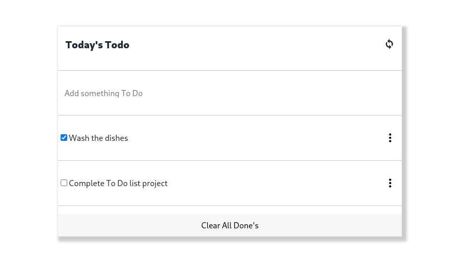

# To Do list: Interactive list

> "To-do list" is a tool that helps to organize your day. It simply lists the things that you need to do and allows you to mark them as complete. This website was created using ES6 and Webpack!

## Built With

- Javascript
- Webpack
- HTML 5
- CSS 3

## Live Demo

[Live Demo Link](https://vicmaburrito.github.io/ToDolist/dist/)

## Authors

👤 **Manuel Aldaraca**

- GitHub: [@vicmaburrito](https://github.com/vicmaburrito)
- LinkedIn: [Manuel Aldaraca](https://www.linkedin.com/in/manuel-aldaraca)

## 🤝 Contributing

Contributions, issues, and feature requests are welcome!

Feel free to check the [issues page](https://github.com/vicmaburrito/To-do_list/issues/new).

## Show your support

Give a ⭐️ if you like this project!

## 📝 License

This project is [MIT](./LICENSE.md) licensed.
